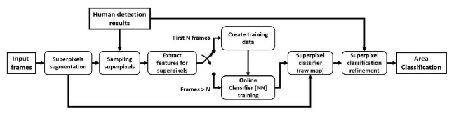
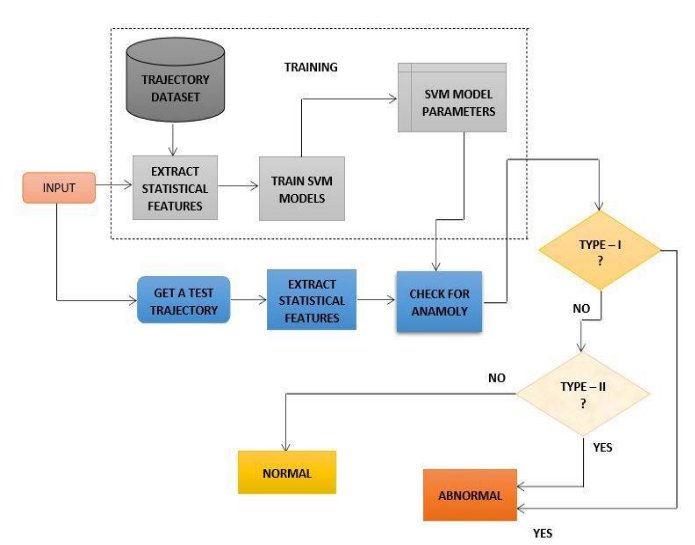

Geek-AI-Mania‘18** 

**2018**

**GEEK-AI-MANIA‘18 **

**SRI MANAKULA VINAYAGAR ENGINEERING COLLEGE PONDICHERRY** 

TEAM MEMBERS DETAIL: 

|NAME |ROLE |EMAIL-ID |MOBILE NO. |
| - | - | - | - |
|AGALYA. M |TEAM LEADER |agalyamuthukrishnan@gmail.com |8489797779 |
|DEEBIGA. K |TEAM MEMBER |deepsdeebi07@gmail.com |9787678372 |

`   `TEAM NAME:  TECH-WARRIORS 

DEPARTMENT:   INFORMATION TECHNOLOGY 

**Contents ![ref1]**

[1.Abstract................................................................................................................................................ 3 ](../Downloads/Idea_Submission_Template_GeekAIMania_updated.doc#__RefHeading__216_842282628)[2.Problem Statement .............................................................................................................................. 4](../Downloads/Idea_Submission_Template_GeekAIMania_updated.doc#__RefHeading__218_842282628) [3.Background Search ............................................................................................................................... 4](../Downloads/Idea_Submission_Template_GeekAIMania_updated.doc#__RefHeading__220_842282628) [4.Approach to the Solution ...................................................................................................................... 5](../Downloads/Idea_Submission_Template_GeekAIMania_updated.doc#__RefHeading__222_842282628) [5.Solution Description ............................................................................................................................. 5](../Downloads/Idea_Submission_Template_GeekAIMania_updated.doc#__RefHeading__224_842282628) [6.Technology Stack  (Software and Hardware) ......................................................................................... 6](../Downloads/Idea_Submission_Template_GeekAIMania_updated.doc#__RefHeading__226_842282628) [7.Technical Solution Architecture .......................................................................................................... 1](../Downloads/Idea_Submission_Template_GeekAIMania_updated.doc#__RefHeading__245_842282628)1 [8.Validate Model & Result ..................................................................................................................... 1](../Downloads/Idea_Submission_Template_GeekAIMania_updated.doc#__RefHeading__247_842282628)2 [9.Results & Trained ............................................................................................................................... 1](../Downloads/Idea_Submission_Template_GeekAIMania_updated.doc#__RefHeading__228_842282628)8 [10.Future Scope of Solution................................................................................................................... 2](../Downloads/Idea_Submission_Template_GeekAIMania_updated.doc#__RefHeading__230_842282628)0 [11.Conclusion ........................................................................................................................................ 2](../Downloads/Idea_Submission_Template_GeekAIMania_updated.doc#__RefHeading__232_842282628)1 [12.Appendix (as applicable)…………………..](file:///C:/Users/Hp/Downloads/Idea_Submission_Template_GeekAIMania_updated.doc%23__RefHeading__234_842282628)...................................................................................................21 

1. **Abstract ![ref1]**

`                   `Ability to recognize and track abnormal human activities is one of the key challenges 

in video surveillance. Surveillance videos captures huge variety of realistic anomalies. With the huge amount of data available in the form of such video, it is impractical to manually analyze the behaviors of all the observed objects to quickly and correctly detect unusual patterns. An intelligent video surveillance system capable of detecting anomalous activities within a video is proposed. Deep learning models are leveraged for this purpose. They can learn  anomalies  with  the  aid  of  training  video  dataset  which  contain  both  normal  and anomalous  events.  Our  proposed  method  uses  CNN  and  a  bidirectional  LSTM  for anomalous action recognition from videos. Convolutional neural network (CNN) has proved its effectiveness in applications such as action recognition, object detection, person detection etc. Recurrent neural network (RNN) and long short-term memory (LSTM) neural network are widely used for learning temporal features from sequential data. The spatial features from frames in a video are first learnt by the CNN. Next, the temporal information is learnt by feeding the learnt features into a bidirectional LSTM network.  

**Introduction:** 

Anomalies in videos are broadly defined as events that are unusual and signify irregular  behavior.  Consequently,  anomaly  detection  has  broad  applications  in  many different  areas,  including  surveillance,  intrusion  detection,  health  monitoring,  and  event detection. Unusual events of  interest in  long  video sequences, e.g. surveillance  footage, often have an extremely low probability of occurring. As such, manually detecting these rare events, or anomalies, is a very meticulous task that often requires more manpower than is generally available. This has prompted the need for automated detection and segmentation of sequences of interest. The process of monitoring activities, behavior etc. for managing, influencing or protecting people is called Surveillance. A popular way of doing this is by observing the objects of interests from a distance with the help of electronic equipment’s: for example, closed-circuit television (CCTV) cameras. CCTV cameras are widely used by organizations to help with safety and security. The analysis of data captured from CCTV cameras help organizations in preventing crimes or unexpected events before they occur. In contrast to the related field of action recognition where events of interest that are clearly defined, anomalies in videos are vaguely defined and may cover a wide range of activities. Since it is less clear-cut, models that can be trained using little to no supervision, including spatio-temporal  features,  dictionary  learning  and  auto  encoders  have  been  applied  to evaluating  anomalies.  The  models  are  evaluated  on  the  UCSD  Ped1  dataset  and  Ped2 dataset, Avenue dataset, UMN dataset and UCF crime dataset. 

2. **Problem Statement ![ref1]**

`               `CCTV cameras produce a huge amount of video data. Effective surveillance can reveal    anomalous events in these videos. Detecting crime occurrences, explosions, accidents etc. are some of the critical tasks in video surveillance. It is challenging to manually find anomalies from the  huge  amount  of  data  available  for  surveillance  purposes  because  of  many  reasons. Occurrence of anomalous events that are of interest for monitoring purpose would be very low compared to normal events. Hence manually analyzing this data to find out anomalous events which has very low probability of occurrence is a very tedious task that causes a considerable amount of man power wastage. Also, manual analysis can lead to human-generated errors. The crowd density in the walkways was variable, ranging from sparse to very crowded. Abnormal events are due to either: the circulation of non-pedestrian entities in the walkways anomalous pedestrian motion patterns. Commonly occurring anomalies include bikers, skaters, small carts, and people walking across a walkway or in the grass that surrounds it. 

3. **Background Search** 
- Video sensors become particularly important in traffic applications mainly due to their fast response, easy installation, operation and maintenance, and their ability to monitor wide areas. Research in several fields of traffic applications has resulted in a wealth of video processing and analysis methods. 
- Two of the most demanding and widely studied applications relate to traffic monitoring and  automatic  vehicle  guidance.  In  general,  systems  developed  for  these  areas  must integrate, amongst their other tasks, the analysis of their static environment (automatic lane finding) and the detection of static or moving obstacles (object detection) within their space of interest. An overview of image processing and analysis tools used in these applications  and  we  relate  these  tools  with  complete  systems  developed  for  specific traffic applications. 
- More specifically, we categorize processing methods based on the intrinsic organization of  their  input  data  (feature-driven,  area-driven,  or  model-based)  and  the  domain  of processing (spatial/frame or temporal/video). Furthermore, we discriminate between the cases of static and mobile camera. Based on this categorization of processing tools, we present representative systems that have been deployed for operation. 
- Thus,  it  is  threefold.  First,  to  classify  image-processing  methods  used  in  traffic applications. Second, to provide the advantages and disadvantages of these algorithms. Third, from this integrated consideration, to attempt an evaluation of shortcomings and general needs in this field of active research. 

  For more refer: [ http://ufdcimages.uflib.ufl.edu/UF/E0/04/57/69/00001/YUAN_Z.pdf ](../Downloads/architect3-1.jpg)

4. **Approach to the Solution ![ref1]**
- An intelligent video surveillance system is proposed which would help in such scenarios. Such a system can automatically analyze a video to detect anomalous activities. To make a system to detect anomalous activities, first it must be trained with anomalous activities.  
- A major challenge in this method is the availability of the appropriate dataset. Anomalies are very contextual in nature and it also varies from domain to domain. So, we must use different datasets for different situations. Also, such a method will fall into the category of supervised learning which needs proper supervision and involved human efforts.  
- To deal with this, the proposed system is trained with normal activities with no or less supervision. This is not a big challenge as most of the activities in a surveillance video are normal.  
- During  testing,  any  activity  which  deviates  from  normal  activity  will  be  detected  as abnormal or anomalous. Such a system will be domain free and can easily be used in any different scenarios.  
- We present an unsupervised algorithm in which a deep learning model is trained with normal behaviors.  
- Convolutional Neural Networks and bidirectional LSTMs are used for learning spatial and temporal features from training videos respectively.  
- Once trained, it can be used to evaluate videos having normal and anomalous events. During testing, the model learns features from the test video and those with features deviating from normal are detected anomalous. 
5. **Solution Description** 
- We can view abnormal behavior detection as a type of high-level operation of image understanding, where logical information is extracted from input image sequences and used to model behavior. 
- The  proposed  method  is  compared  with  few  state-of-the-art  approaches  for  anomaly detection.  
- Dictionary based approaches are widely used in anomaly detection. In this, normal videos are used in training phase to learn features and create and the reconstruction error at the time of testing would detect anomalies.  
- Convolutional neural networks are well known for its image classification capabilities. Fully convolutional feed-forward deep auto-encoder based approaches are also used to learn local features and classify.  
- During training phase, the network is fed with normal videos and features are extracted. ![ref1]In the testing phase, the videos having events deviating from normal are expected to have high reconstruction error.  
- Binary SVM classifier can also be used for classification tasks. Features are computed for each video, and a binary classifier is trained with linear kernel.  
- The  results  show  that  the  proposed  approach  significantly  outperforms  the  existing methods.  Dictionary  based  approaches  is  not  robust  enough  to  discriminate  between normal  and  anomalous  pattern.  It  sometimes  produces  low  reconstruction  error  for abnormal videos.  
- Even though the method proposed which uses Fully convolutional feed forward deep auto-encoder  learns normal patterns effectively, it tends to produce high anomaly scores even for new normal patterns.  
- Proposed method produces high anomaly scores for the anomalous frames and hence is suited for anomaly detection tasks. 
- Our overall goal is to extract simple and reliable features which are descriptive, i.e. can be used by an unsupervised algorithm to discover the important image features in a large video set in order to detect unusual events. 

6. **Technology Stack**  

`             `We employ Convolutional neural network(CNN) and bi-directional Long short- term memory(LSTM). The Proposed algorithm consists of two major functions. First, the features in the frames of the input video is extracted by CNN. Second, action in a set of frames is fed through bidirectional LSTM to study the temporal sequence. The output of  the  bidirectional  LSTM  module  is  analysed  to  recognise  actions  into normal/anomalous activity classes. It consists of three main steps. 

1. **Feature Learning**  

`             `The features are extracted from the video with the help of a convolutional neural network (CNN). CNNs are widely used for object recognition and image classification tasks due to its ability of learning spatial features from an image. CNN is used to learn spatial features from each individual frame in the video. A CNN learns hidden patterns in images. So, it can capture even the smallest changes from  frame to frame. ![ref1]In the proposed algorithm, we used parameters of the pre-trained CNN model, called VGGNet for feature extraction, which is trained on large scale ImageNet dataset of more than 15 million images. On ImageNet dataset, VGGNet achieves a top-5 test accuracy of 92.7%. ImageNet consists of over 14 million images belonging to 1000 classes. The network has 16  convolutional  and  fully  connected  layers.  It  performs  3x3  convolutions  and  2x2 pooling from the beginning to the end. The VGGNet consists of layers which perform 3x3 convolutions with stride 1 and pad 1 and The POOL layers do 2x2 max pooling with stride 2 and no padding from beginning to end. The features of each frame are inputted to the next LSTM layer. 

`                                                      `Fig. Architecture of VGG 16 net 

2. **Learning temporal features** 

`               `Recurrent Neural Networks is used to find the hidden sequential or temporal sequences in the input data. Each input is considered as independent in a traditional feed forward neural network. Though RNNs can interpret sequences, in case of long video sequences it tends to forget earlier inputs. This problem is called the vanishing gradient problem. For this, a special type of RNN, called LSTM is used. LSTMs are capable of learning temporal patterns from long sequences due to its special structure. It has input, output, and forget gates to help with the long-term sequence pattern identification. The gates are adjusted by a sigmoid unit that learns during training where it is to open and close.  

**Operations performed in LSTM unit: ![ref1]**

it = σ((xt + st−1)Wi + bi)        -------à(1) ft = σ((xt + st−1)Wf + bf )      -------à(2) ot = σ((xt + st−1)Wo + bo)    -------à(3) g = tanh((xt + st−1)Wg + bg) -------à(4) ct = ct−1 · ft + g · it         --------------à(5) st = tanh(ct) · ot             --------------à(6) final\_state = soft max(Vst)  --------à(7) 

`         `where  xt  is  the  input  at  time  t.  ft  is  the  forget  gate  at  time  t,  which  clears information  from the memory cell when  needed and keeps a record of the previous frame whose information needs to be cleared from the memory. The output gate ot keeps information about the upcoming step, where g is the recurrent unit, having activation function ‘‘tanh’’ and is computed from the input of the current frame and state of the previous  frame  st−1.  The  hidden  state  of  an  RNN  step  is  calculated  through  tanh activation and memory cell ct. As the action recognition does not need the intermediate output of the LSTM, we made final decision by applying Softmax classifier on the final state of the RNN network. 

`         `The features representing the video sequence of a time interval, T that is received from the previous step is fed to a bidirectional-LSTM. In bidirectional LSTM, the output at time t is not only dependent on the previous frames in the sequence, but also on the upcoming frames. Bidirectional RNNs are quite simple, having two RNNs stacked on top of each other. One RNN goes in the forward direction and another one goes in the backward direction. The combined output is then computed based on the hidden state of both RNNs. In normal time order, input sequence is fed into one network and in reverse time order for another. The outputs of the two networks are usually concatenated at each time  step.  This  structure  allows  the  networks  to  have  both  backward  and  forward information about the sequence at every time step which makes it more effective than other models. 

![ref1]

`                                               `Fig. Structure of a bidirectional LSTM 

3. **Training and Testing Phase**  

`          `During training phase, the model is fed with only normal videos. Each video is then segmented into frames. The CNN first learns the spatial features from each of these frames. When it finishes processing a set of frames, it feeds the feature vector into the bidirectional  LSTM  network.  The  bidirectional  LSTM  network  will  then  learn  the temporal features from the set of frames. The learning will be done for several epochs (e.g. 1000 epochs) and by the end of the training the model will learn the feature vector for normal activities. Softmax classifier is used. During testing phase, the model is fed with both normal and abnormal videos. It calculates the spatial and temporal features of the test videos like in testing phase and the output of bidirectional LSTM network is analyzed  to  detect  if  the  test  video  falls  into  normal/anomalous  activity  class.  The anomaly score value which differentiates a normal video from anomalous video can be found during the experimentation process. 

**ARCHITECTURE: ![ref1]**

- Type-I anomaly is observed when a target is encircling or residing within a region for a prolonged duration of time.  
- Type-II anomaly demonstrates a target switching between two or more regions for a sustained period of time. 
7. **Technical Solution Architecture **

Training videos 

New video 

**Extract  Features**   

**Feature**  Map from feature **descriptons**  Space to behavior label space 

**Model events** 

**(training &** 

**Learning)**  Classifier  Events/behaviour 

models**  

Fig. General process of feature-based modeling and detection of anomalies in video sequences 

8. **Validate Model & Result ![ref1]**

`                `The proposed method is tested on public real-world datasets. The UCSDped1 dataset and the Subway dataset with varying densities of people. The challenge is that the scenes in the datasets are not only crowded but also with some extent of perspective distortion. 

**Evaluation Criteria:**  

**Frame-level evaluation:** If any region in a frame is identified as anomaly to be consistent with the ground truth, such detection is granted to be correct regardless of the location and the size of the region.  

**Pixel-level evaluation:** If over 40% portion of the ground truth are detected as anomalies in a frame, such detection is regarded as a right detection. So, pixel-level evaluation is stricter than frame-level evaluation. 

As for quantitative evaluation, receiver operating characteristic (ROC) reflects the relationship of true positive rate (TPR) against false positive rate (FPR). 

**True positive rate:** The rate of correctly detected frames to all abnormal frames in ground truth.  

`                                  `It is calculated as the ratio of true positive to the summation of true positive and false negative. 

**False positive rate:** The rate of incorrectly detected frames to all normal frames in ground truth.

`                                  `It  is  calculated  as  the  ratio  of  false  positive  to the  summation  of  false positive and true negative. 

ROC curve is plotted according to the detection results under different parameters. 

We quantify the performance in terms of the equal error rate (EER) and the area under ROC curve (AUC). 

The EER is the point on the ROC curve that FPR is equal to 1 − TPR.  

A  smaller  EER  corresponds  with  better  performance.  As  for  the  AUC,  a  bigger  value corresponds with better performance. 

**Event-level evaluation:** If any position with true anomaly is detected and localized as abnormal, the detection is regarded as a correct hit. On the other hand, if ![ref1]any normal frame is detected as anomaly, it is counted as a false alarm in terms of event detection. 

`              `àWe  compare  the  ROC  curves  of  the  proposed  method  with  Gaussian  process regression  (GPR)  ,  sparse  reconstruction  cost  (SRC),  spatio-temporal  compositions  (STC), mixture  of  dynamic  textures  (MDT),  social  force  model  (SFM),  mixture  of  optical  flow (MPPCA), SFM-MPPCA, and local optical flow (LOF). 

`              `àFor  the  frame-level  evaluation,  spatio-temporal  compositions  and  sparse reconstruction  cost  achieve  comparative  performances  in  contrast  to  the  proposed  method. However, frame-level evaluation does not consider whether the detection coincides with the actual location of the anomaly.  

`               `àIn contrast, pixel-level evaluation emphasizes the localization ability of an algorithm. In surveillance videos, perspective distortion causes the motion vectors not consistent with each other to fall in diverse directions and scales. This will significantly affect anomaly detection in local regions. Since the probability threshold is capable of adapting to perspective distortion, the proposed method performs much better at pixel level. 

1) Frame-level evaluation                                      b)  Pixel-level evaluation 

`                                 `**The comparison of ROC curves on the UCSDped1 dataset**  

`                                                              `**Using different approaches** 

**Comparison of EER and AUC using different methods ![ref1]**

`                                      `àAUC is the area under ROC curve 

`                               `àEER is equal error rate:- means the results are not provided 

The proposed method is implemented using MATLAB and the experiments are performed on a computer with Core i7-2600 CPU and 16GB RAM. 

Our method requires less learning and inferring time, approximately 175milliseconds per frame, which contains the shape feature extraction and the construction and inference of the K-NN similarity-based model. 

It is obviously that the proposed method is very efficient. 

**TEST RESULTS: ![ref1]**

1. **UCSD Pedestrian 1** 

   

Fig. Anomaly evaluation graphs of test clips from the UCSD Pedestrian 1 dataset. 

2. **UCSD Pedestrian 2 ![ref1]**

Fig. Anomaly evaluation graphs of test clips from the UCSD Pedestrian 2 dataset. 

3. **Avenue ![ref1]**

Fig. Anomaly evaluation graphs of test sequences from the Avenue dataset 

9. **Results & Trained ![ref1]EXPERIMENTATION:** 
- In the training phase, videos are first segmented into frames using opencv. Features are extracted from each frame with the help of VGG Net.  
- The CNN takes one frame at a time as input. Once the number of frames denoted by the value MAX\_ALLOWED\_FRAMES has been processed, the encoded features of these frames are fed into bidirectional LSTM module for motion encoding.  
- The  spatial  features  are  extracted  from  the  fully  connected  (FC)  layer  FC3  of  the VGGNet. The parameter BATCH\_SIZE is for mini-batch gradient descent used for the LSTM training.  
- The optimizer used is RMSProp optimizer. Root Mean Square Propagation (RMSProp) maintains per-parameter learning rates that are adapted based on the average of recent magnitudes of the gradients for the weight.  
- Mini-batches of size 64 is used and each training volume is trained for a maximum of 20 epochs.  
- Softmax is used as the activation function for the output layer and the categorical cross entropy as the loss function. The deep learning algorithms are implemented using Keras library with backend as Tensorflow. 

**TRAINED DATASET:** 

- **UCSD dataset:**
- We conduct anomaly detection and localization test on the UCSDped1 dataset [13], which records a large number of pedestrians walking on the walkway.** 
- The ped1 dataset shows the scene of pedestrians moving towards and away from the stationary camera, with a resolution of 158 × 238 (34 clips for training, and 36 clips for testing).**  
- The ped2 dataset contains scenes with pedestrians moving parallel to the camera, with a resolution of 360 × 240 (16 clips for training and 14 clips for testing).**  
- The UCSDped1 consists of 200 frames in all the training and test sequences whereas the UCSDped2 contains frames ranging between ![ref1]120, 150 and 180 frames in different training sequences and 180 frames for all the test sequences.** 
- **Anamolies in UCSD Ped1 dataset:** 

a)Cycle                                                  c)   Skater 

2) Wheel chair                                d)  Cart 
- **Anamolies in UCSD Ped2 dataset:** 

e) Cart                                              f)  Bicycle 

**ACCURACY TEST RESULTS: ![ref1]**

`               `For estimating test accuracy, 100 videos are taken. In this set 64 videos are videos containing  anomalous  activities  and  36  are  normal  videos.  The  Accuracy  is  calculated  as (TP+TN)/total = (52+29)/100 = 81%. TP is the number of actual anomalous videos that are predicted as anomalous. TN is the number of actual normal videos which is predicted as normal. 

Fig. Test Accuracy of the proposed method 

10. **Future Scope of Solution** 
- It  monitors  the  abnormal  events  that  occur  due  to  the  circulation  of  non-pedestrian entities in the footpath more accurately.  
- Also we can able to measure the overall count of people who pass through the footpath every-day. 
- When any abnormal activities takes place it will warn the pedestrians who misbehave in the pathway through voice bot.  
- When  any  crime  activities  takes  place  such  as  Abuse,  Arrest,  Accident,  Burglary, Explosion, Fighting, Robbery, Shooting etc., it automatically conveys the information about that particular incident to the nearby police station. 
- When any fire accidents occur, the system immediately conveys information to the fire station along with the location and also to the near by police station so that the injuries caused to pedestrians may be avoided and also damages caused to the public places may be avoided. 
11. **Conclusion ![ref1]**

`              `We proposed a deep learning approach to detect real world anomalies in surveillance videos. The deep learning algorithms such as CNN and bidirectional LSTMs are used to learn spatial and temporal features from UCSDped1 and UCSDped2 dataset and UCF-Crime dataset. Most of the previous researches on video anomaly detection were done on unrealistic and staged video datasets. Because of that it may fail to give accurate output in case of realistic anomalies. The UCSD and UCF-Crime dataset in contrast had untrimmed video sequences which contain both anomalous and normal events. This makes it more effective for video anomaly detection tasks. The advantage of the proposed method is that it is semi-supervised. Training data required is only of the normal events expected. Getting normal videos is not challenging as the occurrence of normal events is very much high compared to abnormal events. In future, a module can be further  added  to  the  proposed  method  which  can  classify  the  already  classified  anomalous activities into various activity classes. It will be a supervised module as the module must be trained with different labeled datasets so that it can identify activity. 

12. **Appendix (as applicable)** 
- N.  Ballas,  L.  Yao,  C.  Pal,  A.  Courville,  "Delving  Deeper  into  Convolutional  Networks  for Learning Video Representations," in ICLR, 2016. 
- Y. Zhu, I. M. Nayak, and A. K. Roy-Chowdhury. Context aware activity recognition and anomaly detection in video. In IEEE Journal of Selected Topics in Signal Processing, 2013. 
- A.Ogawa and T.Hori,‘‘Error detection and accuracy estimation in automatic speech recognition using deep bidirectional recurrent neural networks,’’ Speech Commun., vol. 89, pp. 70–83, May 2017.  
- J. C. Niebles, H. Wang, and L. Fei-Fei, “Unsupervised learning of human action categories using spatial-temporal words,” Int. J. Comput. Vis.,vol. 79, pp. 299–318, 2008. 
- T. Tieleman and G. Hinton, “Lecture 6.5-rmsprop: Dividethe gradient by a running average of its recent magnitude,”in COURSERA: Neural Networks for Machine Learning,2012. 
- X. Zhang, S. Yang, Y. Y. Tang, and W. Zhang. A thermodynamics-inspired feature for anomaly detection  on  crowd  motions  in  surveillance  videos.  Multimedia  Tools  and  Applications, 75(14):8799–8826, Jul 2016. 
21 

[ref1]: Aspose.Words.04a37028-8bd7-46b5-abf3-0fc0dc84d63a.002.png
